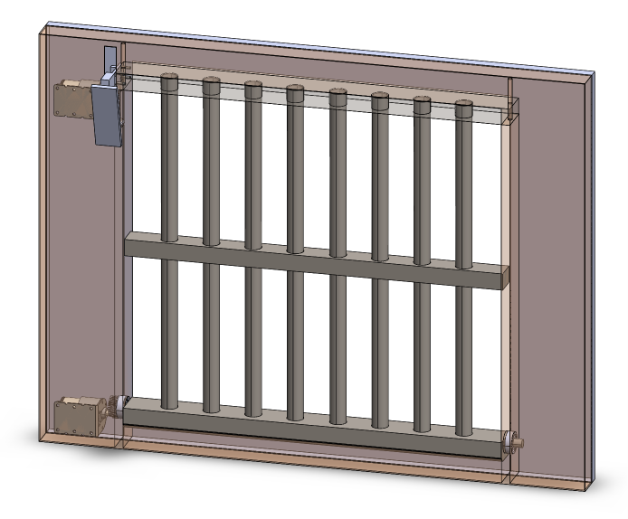
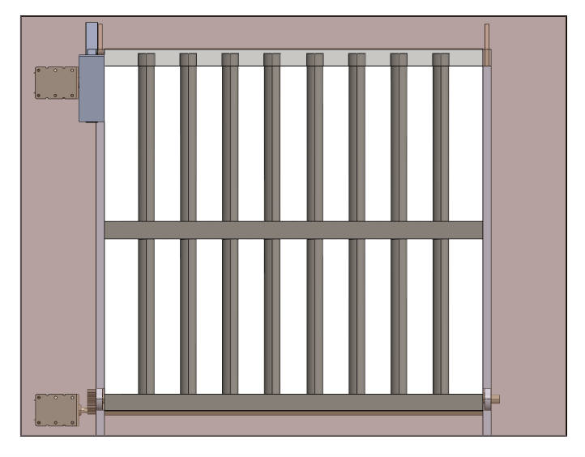
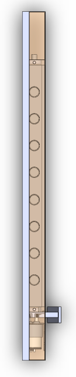
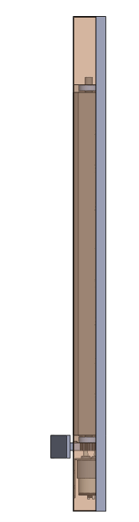
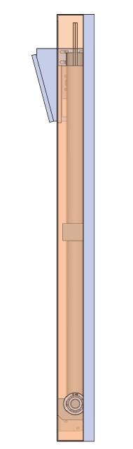
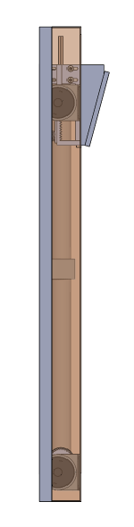
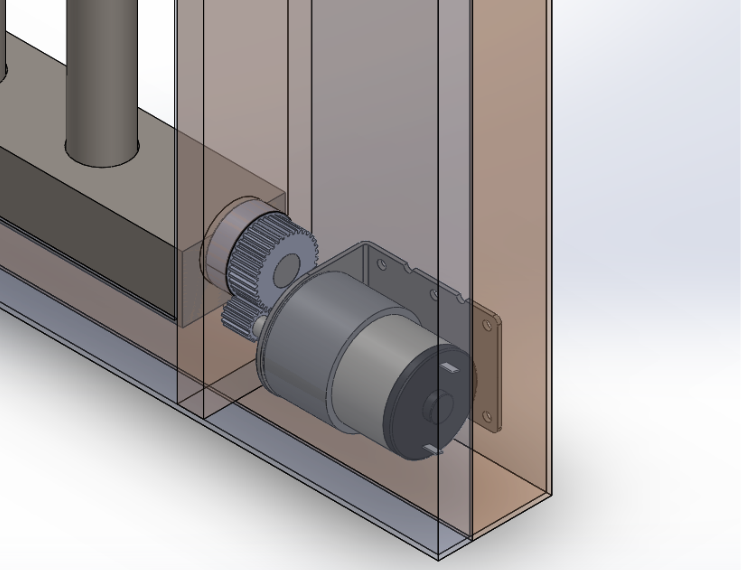
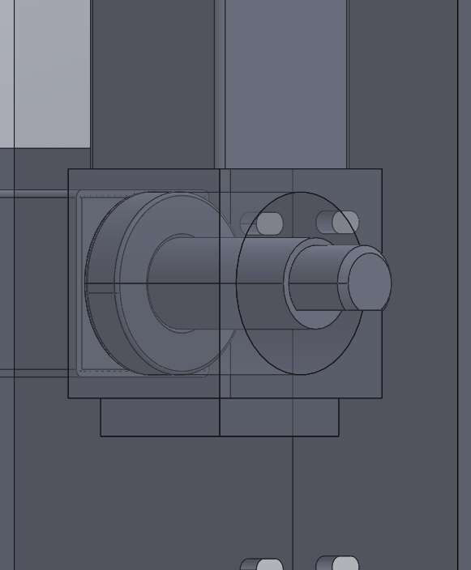
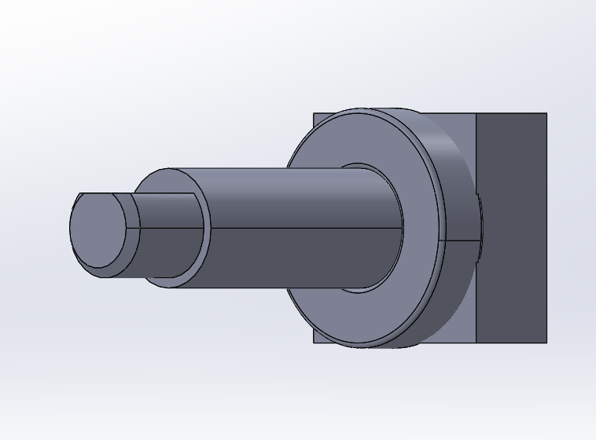

# Security Window

A motorized security window grille designed in SolidWorks. A geared DC motor drives the bar grille along its frame through a gear-and-pinion train, and a second motor-driven rack mechanism at the top locks it in place.

## Views

| Front | Top | Bottom |
|:---:|:---:|:---:|
|  |  |  |

| Left side | Right side |
|:---:|:---:|
|  |  |

## Drive Mechanism

| Motor and gear train | Bearing housing | Shaft and bearing |
|:---:|:---:|:---:|
|  |  |  |

## Components

| Part | File |
|---|---|
| Main frame | `main_frame_fin.SLDPRT` |
| Middle member (grille bars) | `member_middle_fin.SLDPRT` |
| Upper / lower slots | `slot_upper_fin.SLDPRT`, `slot_lower_fin.SLDPRT` |
| Cover plate | `cover_fin.SLDPRT`, `plate_fin.SLDPRT` |
| Geared DC motor (HSIANG NENG HN-35GMB-1345T) | `Geared DC motor - HSIANG NENG HN-35GMB-1345T_fin.SLDPRT` |
| Motor bracket (37 mm) | `Suporte_Motor_37mm (1)_fin.SLDPRT` |
| Gear, pinion, rack | `gear_fin.SLDPRT`, `pinion_fin.SLDPRT`, `rack_fin.SLDPRT` |
| Shaft | `shaft_fin.SLDPRT` |
| Bearing (SKF 6000 RS, 10 mm) | `10mm Bearing SKF 6000 RS 667-1122_fin.SLDPRT` |
| Spring | `spring_fin.SLDPRT` |

## Files

- `frame_assy_fin_step2.SLDASM` – latest full assembly
- `frame_assy_fin_main_sldprtassem.SLDASM` – main assembly
- `frame_assy_fin_drawing.SLDDRW` – engineering drawing
- `frame_assy_fin_step.STEP` – neutral STEP export for other CAD tools

## Opening

Open `frame_assy_fin_step2.SLDASM` in SolidWorks and keep all part files in the same folder. Without SolidWorks, import `frame_assy_fin_step.STEP` into Fusion 360, FreeCAD, Onshape, or any CAD tool that reads STEP.
